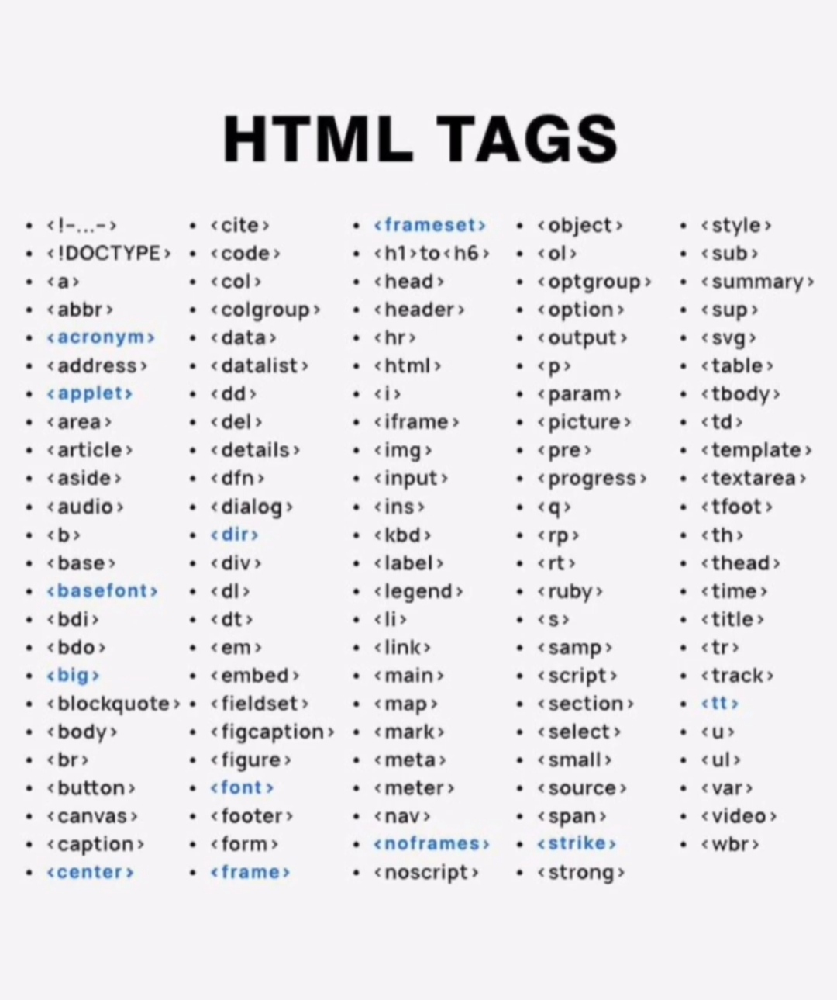

# html_tags
ده تكليف بسيط مطلوب نعمل الصفحة بالشكل اللى ف الصورة تحت

## الوسائل المساعدة
صورة توضيحية


النص اللى هيتكتب
``` HTML
HTML TAGS

• <!-...->
• <cite>
• <style>
• <frameset>
• <object>
• <h1> to <h6>
• <ol>
• <!DOCTYPE>
• <code>
• <sub>
• <a>
• <head>
• <summary>
• <abbr>
• <col>
• <colgroup>
• <data>
• <header>
• <optgroup>
• <option>
• <output>
• <sup>
• <acronym>
• <hr>
• <svg>
• <address>
• <datalist>
• <html>
• <p>
• <table>
• <applet>
• <dd>
• <i>
• <param>
• <picture>
• <tbody>
• <td>
• <area>
• <del>
• <iframe>
• <article>
• <details>
• <pre>
• <template>
• 
• <input>
• <aside >
• <dfn>
• <progress>
• <textarea>
• <audio >
• <ins>
• <q>
• <tfoot>
• <dialog >
• <dir>
• <b>
• <kbd>
• <rp>
• <th>
• <base>
• <basefont>
• <div>
• <label>
• <rt>
• <thead>
• <dl>
• <ruby >
• <time>
• <legend>
• <li>
• <bdi>
• <dt>
• ‹s›
• <title>
• <bdo>
• <em>
• <link>
• <samp>
• <tr>
• <track >
• <script>
• <section>
• <tt>
• <big>
• <embed>
• <main>
• <blockquote>
• <fieldset>
• <map>
• <body>
• <figcaption>
• <mark>
• <br>
• <figure>
• <meta>
• <button>
• <font>
• <meter>
• <select>
• <u>
• <small>
• <ul>
• <source>
• <var>
• <canvas>
• <footer>
• <nav>
• <video>
• <span>
• <strike>
• <caption>
• <form>
• <noframes>
• <wbr>
• <center>
• <frame>
• <noscript>
• <strong>
```

